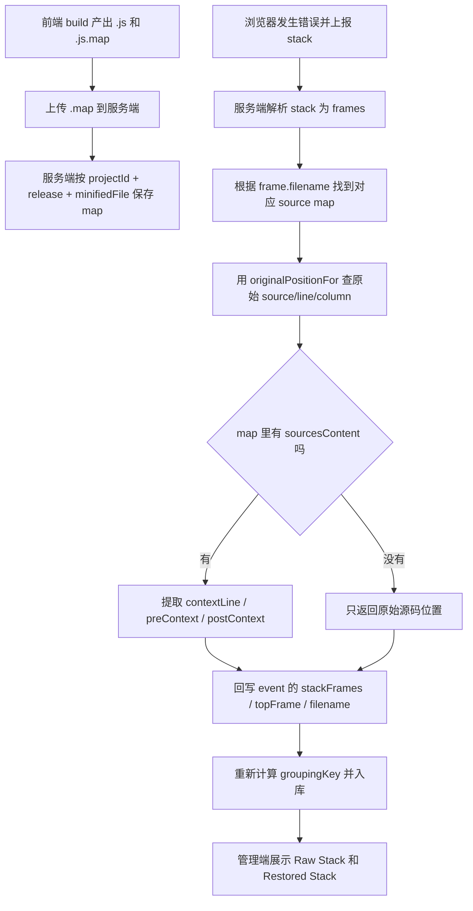

# Source Map 解析与源码还原流程

这份文档只讲一条主线：

`浏览器报错 -> 服务端找到 source map -> 把压缩位置翻译回源码位置 -> 展示源码上下文`

## 先记住一句话

浏览器真正上报给服务端的，通常是压缩后 bundle 的位置，例如：

```txt
http://localhost:4173/assets/minifiedCrash-D9FE3kdg.js:1:184
```

服务端要做的，就是拿对应的 `.map` 去查表，把这个位置翻译回：

```txt
../../src/minifiedCrash.ts:23:22
```

## 流程图



## 这个仓库里两份核心代码分别做什么

### 1. `sourcemap.storage.ts`

负责“把 source map 管起来”：

- 规范化 bundle 路径
- 接收上传的 `.map`
- 保存到 `.data/sourcemaps/...`
- 放进内存缓存
- 后续按 `projectId + release + bundle 路径` 取回

你可以把它理解成：

`Source Map 仓库管理员`

### 2. `sourcemap.symbolicate.ts`

负责“拿 source map 去翻译错误位置”：

- 把 stack 字符串拆成 frames
- 找到对应的 source map
- 把压缩后的 `line/column` 翻译成源码 `line/column`
- 如果 map 带了源码内容，再取出报错附近几行代码
- 把还原结果回写进 event

你可以把它理解成：

`Source Map 翻译员`

## 你真正需要理解的 4 个关键点

### 1. 为什么要上传 `.map`

因为浏览器线上执行的是压缩后的 bundle，报错位置也是 bundle 里的位置。
如果没有 `.map`，服务端只知道：

```txt
assets/index.js:1:184
```

但不知道它在源码里对应哪一行。

### 2. 为什么要带 `release`

同一个项目会不断发版。
`release` 的作用就是告诉服务端：

`这次错误要去匹配哪一版 sourcemap`

### 3. 为什么要“路径规范化”

浏览器 stack 里的文件名可能长这样：

```txt
http://localhost:4173/assets/index.js?v=1#abc
```

但上传 sourcemap 时你存的可能是：

```txt
assets/index.js
```

所以服务端要先把两边整理成同一种格式，否则匹配不上。

### 4. 为什么还要取源码上下文

只知道：

```txt
src/foo.ts:23:22
```

已经比压缩位置好很多了。

但如果还能顺便显示：

```ts
return () => {
  shape.node!.leaf.run();
};
```

你在管理端排查问题时会快很多。

## 最小心智模型

如果你暂时不想看太多实现细节，只记这个最小版本就够了：

```ts
// 1. 上传 map
saveMap(projectId, release, minifiedFile, sourceMap)

// 2. 发生错误时，还原 stack
frames = parseStack(stack)
map = getMap(projectId, release, frame.filename)
original = map.originalPositionFor({ line, column })
source = map.sourceContentFor(original.source)
return restoredFrames
```

## 建议你按这个顺序读代码

1. 先看 `apps/react-demo/src/App.tsx`
   理解错误是怎么被制造出来的

2. 再看 `apps/server/src/services/sourcemap.storage.ts`
   重点看 `uploadSourceMaps` 和 `loadSourceMap`

3. 再看 `apps/server/src/services/sourcemap.symbolicate.ts`
   重点看 `symbolicateFrame` 和 `symbolicateStackFrames`

4. 最后看 `symbolicateNormalizedEvent`
   这是把“还原结果接回监控事件”的一步
